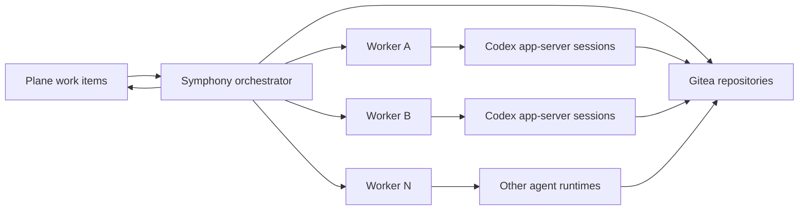

# Distributed Worker Architecture

ForgeFlow should keep project management, orchestration, and agent execution as separate concerns.

## Roles

### Plane

Plane is the project management system. It owns work item state, assignment, comments, and priority.

### Gitea

Gitea is the source control system. It owns repositories, branches, commits, pull requests, and code
review state.

### Symphony

Symphony is the orchestration control plane. It polls Plane, decides which work item should run,
selects an available worker, prepares a workspace, starts an agent session, watches progress, and
updates Plane.

Symphony should not embed a specific programming agent runtime. It should treat agent execution as a
worker capability.

### Worker

A worker is an execution host reachable by SSH. It can be a VM, bare-metal host, or container with an
SSH server. Each worker owns:

- Codex, Claude Code, or another compatible agent runtime
- Agent credentials
- Git credentials for Gitea
- Language runtimes and build tools
- Task workspaces

## Runtime Flow



1. Symphony polls Plane for candidate work items.
2. Symphony selects a worker with free capacity.
3. Symphony connects to the worker over SSH.
4. The worker creates a workspace for the work item.
5. The worker clones the configured Gitea repository.
6. Symphony starts the configured agent command inside that workspace.
7. The agent edits code, runs verification, and pushes changes.
8. Symphony records progress, completion, or blockers back to Plane.

## Worker Registration

The current MVP uses static SSH worker registration in `WORKFLOW.md`:

```yaml
worker:
  ssh_hosts:
    - "worker-01.example.com:22"
    - "worker-02.example.com:22"
  max_concurrent_agents_per_host: 3
```

This gives total capacity of:

```text
total_capacity = worker_count * max_concurrent_agents_per_host
```

Later versions can replace static registration with a dynamic worker registry, heartbeat, and
capability discovery.

## Agent Runtime Contract

For Codex workers, each worker must provide:

```sh
codex app-server
```

on `PATH`.

The command is configured in the workflow:

```yaml
codex:
  command: "codex app-server"
```

For other agents, ForgeFlow should introduce a generic agent provider interface instead of forcing
everything through the Codex app-server protocol. Until that exists, non-Codex workers need a wrapper
that speaks the expected app-server protocol.

## Worker Image MVP

A practical first worker image should include:

- `openssh-server`
- `git`
- `bash`
- `ripgrep`
- Codex CLI
- Gitea credentials mounted as secrets or SSH keys
- Codex credentials mounted as secrets
- Common build tools for the target repositories

The orchestrator image should remain small and contain only Symphony plus SSH client tooling.

This repository includes a local MVP worker setup:

- `Dockerfile.worker-codex`: Codex worker image with SSH server.
- `docker-compose.plane-gitea.local-workers.yml`: one Symphony orchestrator and two Codex workers.
- `WORKFLOW.plane-gitea.local-workers.md`: Plane + Gitea workflow configured for both workers.
- `ssh_config.local-workers`: SSH settings used by the orchestrator to reach local worker containers.

Run the local worker stack with:

```sh
docker compose -f docker-compose.plane-gitea.local-workers.yml up --build
```

Before running it, the host should have:

- `${HOME}/.ssh/id_rsa` and `${HOME}/.ssh/id_rsa.pub` for orchestrator-to-worker SSH.
- `${HOME}/.codex` for Codex authentication on workers.

## Local End-to-End Demo

For a self-contained demo that does not require real Plane, Gitea, or Codex credentials, run:

```sh
./scripts/prepare-demo-repo.sh
docker compose -f docker-compose.demo-ssh-workers.yml up --build
```

The demo starts:

- A mock Plane API with one `Todo` work item.
- A local bare Git repository mounted into both workers.
- Two SSH workers.
- Symphony on `http://localhost:4000`.
- A demo Plane page on `http://localhost:8000`.

Create demo work items from `http://localhost:8000`. Symphony polls `Todo` items, dispatches each
item to an SSH worker, and updates the matching mock Plane item to `Done` when the demo app-server
finishes.

The demo worker command clones the local repository, writes `FORGEFLOW_DEMO_RESULT.md`, marks the
mock Plane item as `Done`, and then exits. The dashboard should briefly show one running session and
then return to an empty state after completion.

## Security Boundary

Workers execute untrusted model-generated commands. Treat each worker as an isolated execution
environment:

- Run workers with least privilege.
- Use one workspace per work item.
- Prefer ephemeral workers or regularly cleaned persistent workers.
- Keep orchestrator credentials separate from worker credentials.
- Mount agent and Git credentials only into workers that need them.
- Restrict network access where possible.

## MVP Milestones

1. Keep Symphony as a pure orchestrator container.
2. Add a dedicated Codex worker image.
3. Add a local Compose file with one orchestrator and two SSH workers.
4. Verify worker capacity with `max_concurrent_agents_per_host`.
5. Run a Plane work item end to end against a test Gitea repository.
6. Add a dynamic worker registry after the static SSH MVP works.
